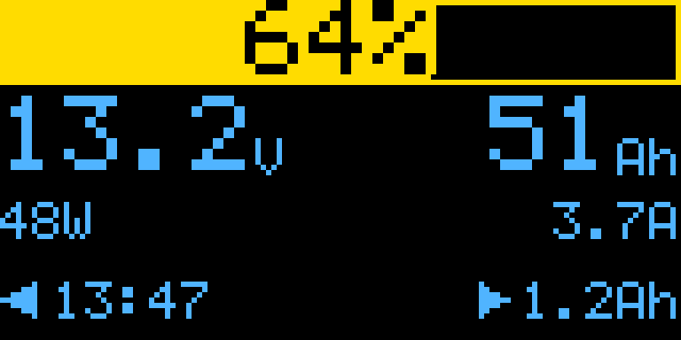
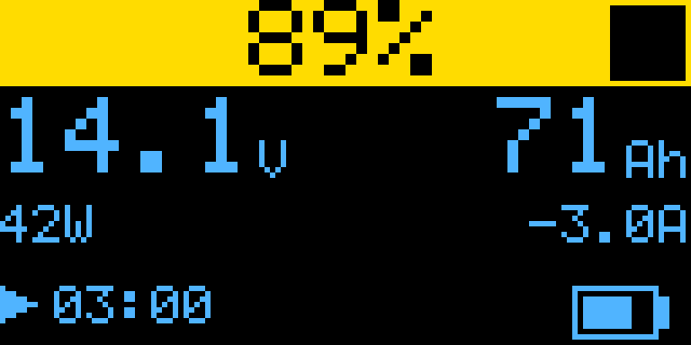
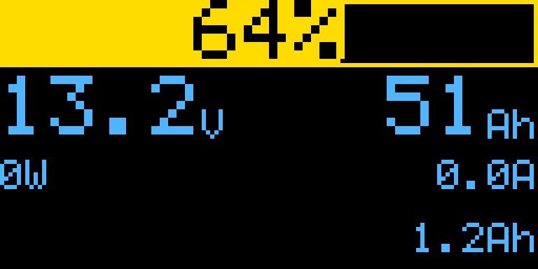
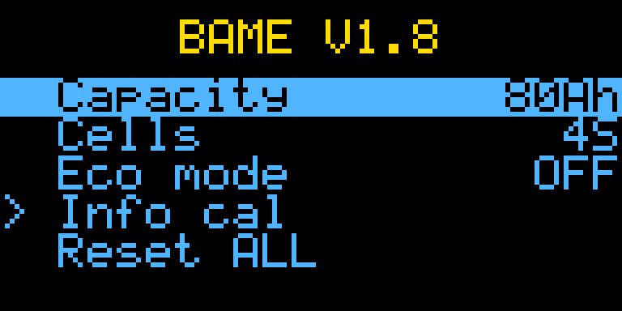
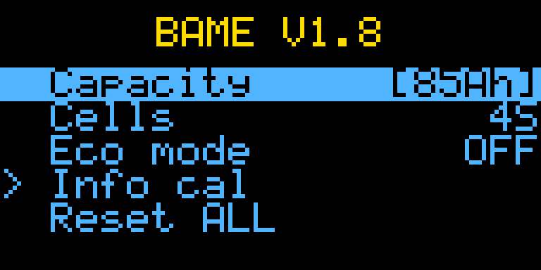
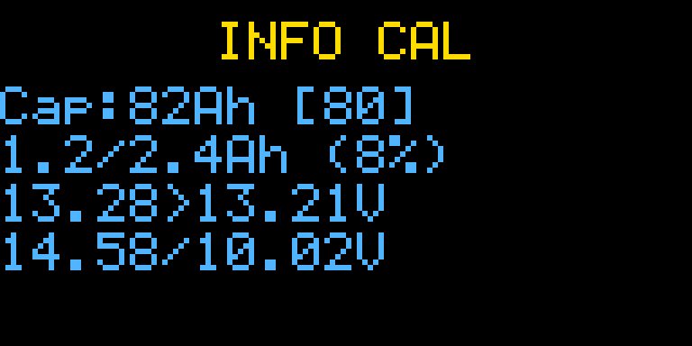

# BAME - Battery Monitor

Firmware for a LiFePO4 12V battery monitor with automatic capacity calibration. Voltage range auto-calibrates from actual battery readings.

## Features

- **Auto capacity calibration** using exponential doubling: estimates converge with each discharge/rest cycle
- **SOC estimation** from voltage lookup + coulomb counting + rest blending
- **INA226 current auto-zero** eliminates offset drift
- **Eco mode** (deep sleep) with adaptive wake interval
- **OLED display** with SOC gauge, voltage, current, power, time remaining
- **Configurable** cell count (1-16S), nominal capacity, eco mode
- **Calibration simulation** tool for parameter validation

## Screenshots

### Main display — discharging



### Main display — charging



### Main display — at rest



### No battery


### Settings menu



### Editing a value



### Info cal page



## How it works

### Calibration

The system measures energy consumed (coulombs) between two rest voltage readings. It starts with a 2-minute segment and doubles the target each time. Each estimate is weighted by its delta SOC — large segments have more influence. The capacity starts at the nominal value and converges continuously.

A segment is invalidated if sustained charging (>1A for >10s) is detected. Brief current spikes from load cycling (compressor, etc.) are tolerated.

### SOC estimation

At rest (current < 0.3A for 5s), the SOC blends 8% toward the voltage-based estimate. This corrects coulomb counting drift while avoiding jumps on the flat LFP voltage curve.

### Voltage calibration

Vmin and Vmax converge toward observed rest voltages. This adapts the SOC curve to the actual battery without changing the LFP curve shape.

## Build

Requires [PlatformIO](https://platformio.org/).

```bash
# Prototype (Arduino Nano)
pio run -e nano -t upload

# Production (ATmega328PB + USBasp)
pio run -e prod -t upload
```

## Controls

| Action | Effect |
|--------|--------|
| Hold center 0.5s | Open settings menu |
| Hold center 3s | Enter deep sleep |
| Hold any button at boot 5s | Keypad calibration |
| UP/DOWN in menu | Navigate / change value |
| CENTER in menu | Enter edit / save |
| LEFT in menu | Cancel edit / go back |

## License

MIT — see [LICENSE.txt](LICENSE.txt)
