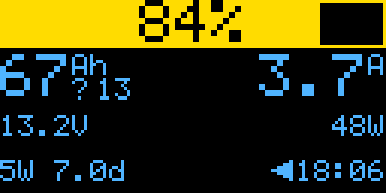
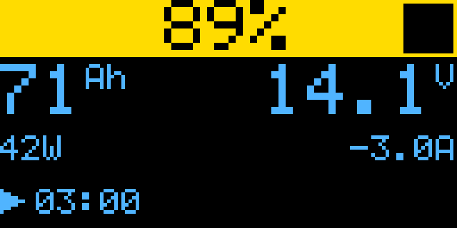
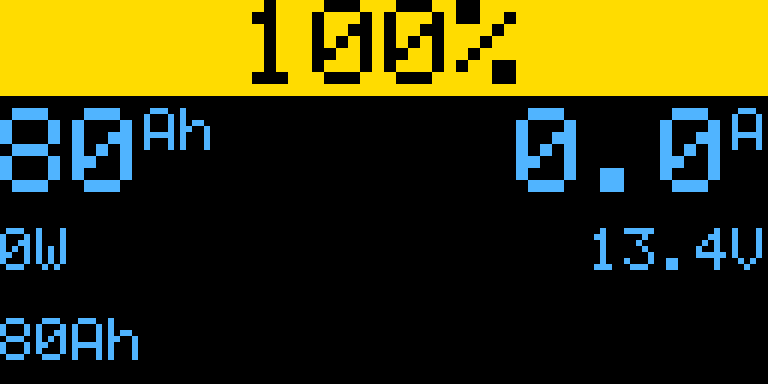
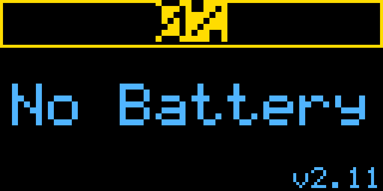

# BaMe - Battery Meter

> **Want to build & flash your own?** → [QUICKSTART.md](QUICKSTART.md)

A small, unambitious side project to put repurposed "dumb" golf-cart LiFePO4 batteries to work in a camping van. No BMS, no data interface, no datasheet — just a cheap pack of cells and a sticker with a capacity that's probably optimistic.

Yes, buying a proper modern battery with its own BMS and bluetooth app would do this better. But it's more fun to poke at the problem with an Arduino, an INA226 shunt and a small OLED than to click "add to cart". If you like that kind of thing, this is that kind of thing.

BaMe watches current through the shunt, integrates it, and shows you a gauge, remaining Ah, voltage, watts and estimated time. Deep discharge cycles teach it the real capacity of your pack: whenever a cycle delivers more Ah than the current estimate, the estimate rises to match — the value on the sticker is usually wrong.

## Features

- **Pure coulomb counting** — charge in, charge out, tracked continuously. No voltage-SOC trick on the flat LFP curve.
- **Capacity learned from real cycles** — the deepest discharge since the last "battery full" is checked at the next full event; if the cycle delivered more than the current capacity estimate, the estimate rises to match. Raise-only, so BaMe learns "this pack is at least this big" and never walks the estimate back on a shallow cycle.
- **Auto-detect "battery full"** — voltage at top OCV with low current, sustained, resets the SOC to 100%.
- **Auto-detect "charger attached"** (LOAD install) — voltage kicks >0.5 V on plug in, drops >0.5 V on unplug. Hysteresis filters the LFP rebond.
- **Smoothed watts & autonomy** — EWMA on the current so a cycling fridge doesn't make the display jump.
- **Configurable at build time** — cell count, wiring topology, voltage window. See `platformio.ini`.

## Screenshots

### Main display — discharging



### Main display — charging



### Main display — at rest



### No battery



## How it works

### Wiring

Two topologies, picked at compile time.

- **BUS** — shunt is on the battery bus, every current (load and charge) flows through it. Coulomb counting is bidirectional. The natural choice when you build from scratch.
- **LOAD** — shunt is on the load side, charger bypasses it. BaMe never sees charge current. Used when retrofitting into an existing install.

### Capacity measurement

BaMe powers itself from the very battery it measures, so a BMS cutoff is a power-loss event it can never witness — there is no "end of cycle" sample to record. Instead it tracks the peak depth of discharge since the last "battery full" event. At the next full event, if that peak exceeds the current capacity estimate, the estimate is raised to match (amplitude-max, raise-only). Each deep cycle proves a lower bound on the real capacity; repeated cycles converge upward to it. Until a cycle has confirmed the capacity this way, BaMe shows the sticker value with a `*`.

### SOC uncertainty

Voltage never "corrects" the coulomb counter — LFP's flat curve makes that correction actively harmful. If something happens BaMe can't quantify (LOAD install with an invisible partial charge, or missing events after a reset), a `?` appears next to the Ah reading to flag that the displayed SOC drifted from reality. The next confirmed "battery full" event clears it.

### Events BaMe listens for

- **Full** — voltage ≥ top OCV with rest current, sustained → SOC = 100%, close the cycle (capacity may be raised), start a new one
- **Charger plug / unplug** (LOAD only) — rapid voltage rise / drop, detected via a slow-moving average that can't keep up with real chargers

A BMS cutoff is deliberately *not* an event: it cuts BaMe's own power supply, so the firmware reboots instead of observing it. That's why capacity learning hangs off the full event.

## Build

[PlatformIO](https://platformio.org/) wrapped in a small Makefile. See [QUICKSTART.md](QUICKSTART.md) for the quick path.

```bash
make                     # build the default env (nano-bus-4s)
make upload              # upload over USB
make ENV=nano-load-4s upload
make list-envs           # show all available variants
```

Each env name encodes hardware × wiring × cell count (e.g. `nano-load-4s` = Arduino Nano, LOAD install, 4-cell LFP / 12 V).

## Controls

None. BaMe is plug-and-forget: no buttons, no menu. It's installed once and left
to run. Capacity starts at the compile-time value (`BATTERY_CAPACITY_AH` /
`BAME_CELLS` in `platformio.ini`) and refines itself from real cycles — nothing
to configure at runtime. The OLED sleeps after 2 min of no electrical activity
and wakes on any current or voltage change (see the display behaviour above).

## License

MIT — see [LICENSE.txt](LICENSE.txt)
